# Clone_Snapdeal
 
 ## Project Description
 
This is our first project at Masai School. For Educational Purposes, We try to build a Snapdeal clone using Html, CSS, JS, and Local Storage,our task is to make a clone of the snapdeal website in 6 days. 

We decided to clone all the important functionality pages from this website, and each individual was assigned their specific task and the project was made by mutually collaborating. We learned about the positions and overflow properties of CSS our Html skills also improved. And logic for creating many of the common features available in most of the websites improved.

## Technologies Used
 - Html
 - Css
 - Javascript

 ## Pages Included
 - Landing page.
 - Login / Signup.
 - Product details page.
 - Category page.
 - Product cart page.
 - Payment page.

## Screenshots 
- Landing Page
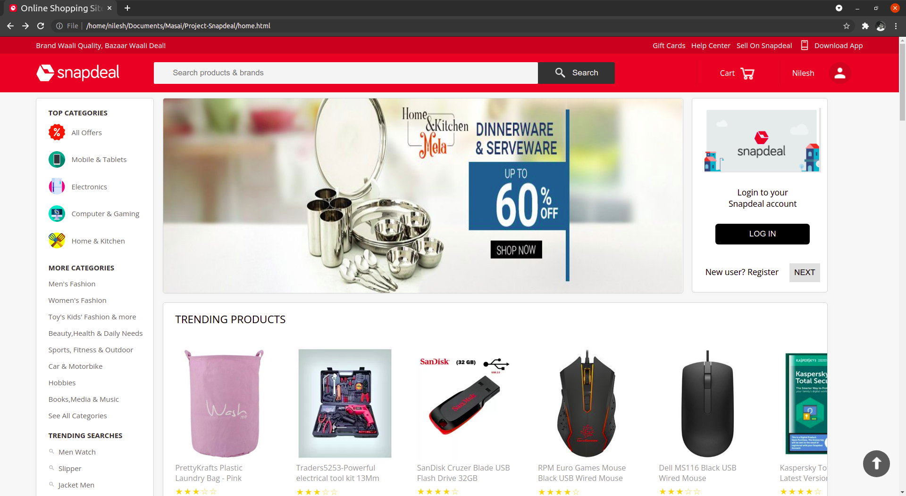
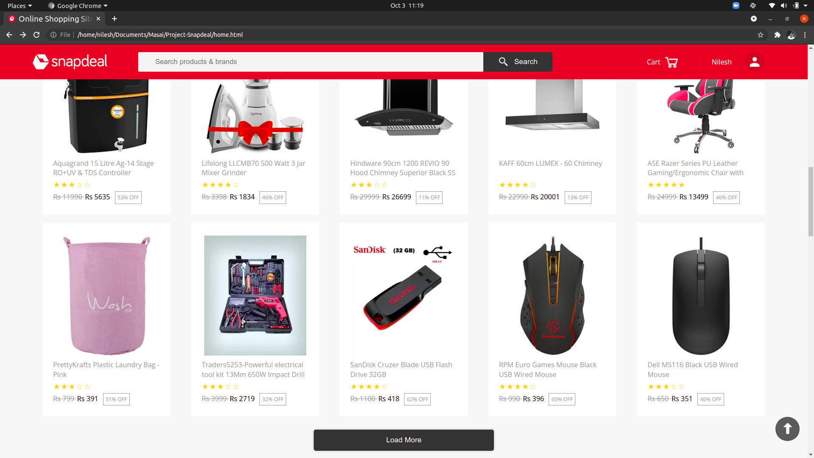 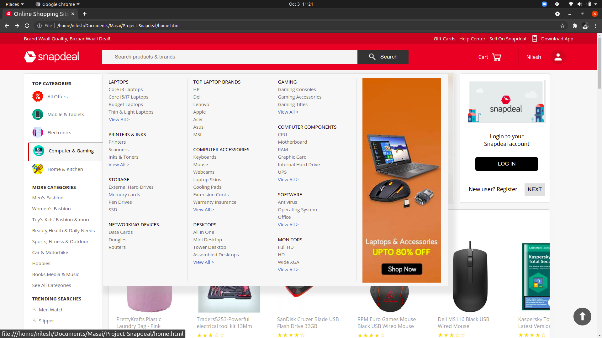

- Login/Signup
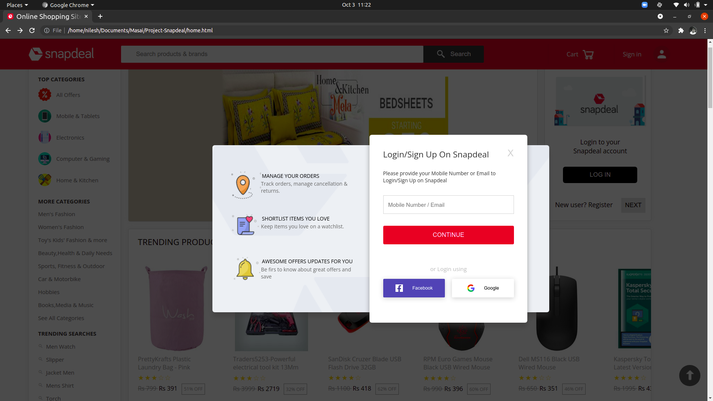
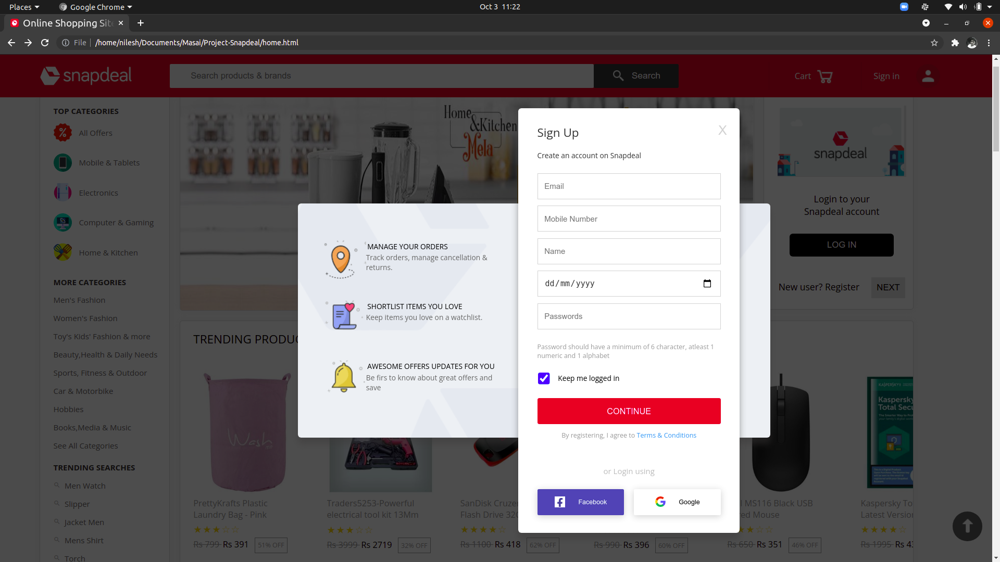 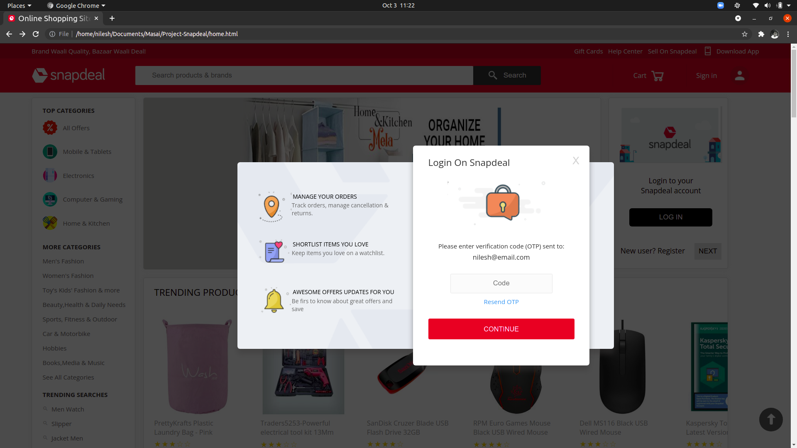

- Product Detail Page
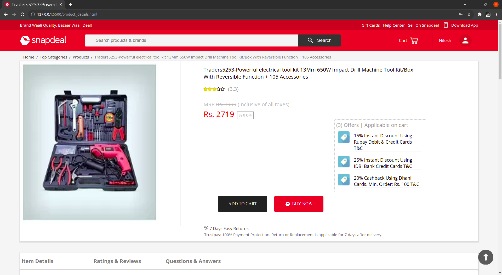

- Category Page
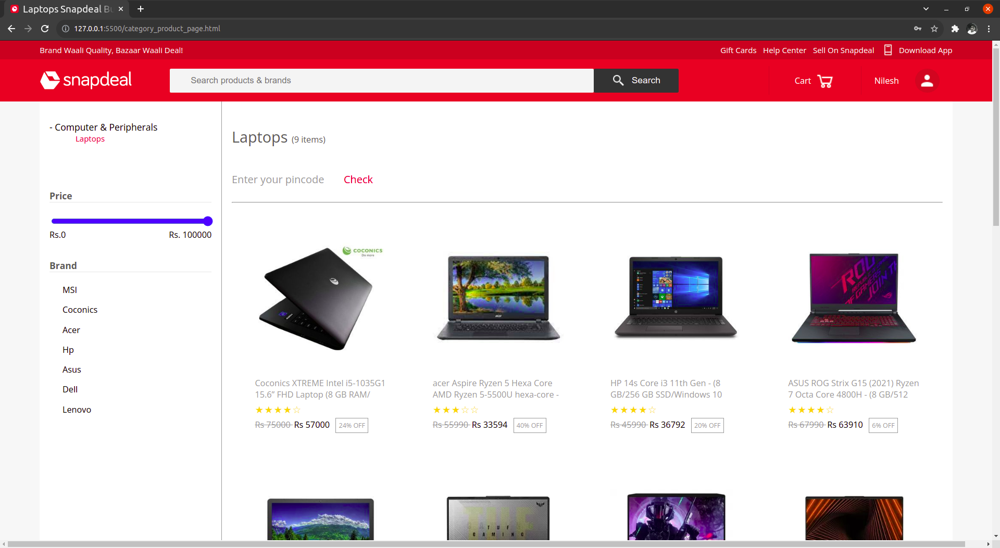

- Product Cart
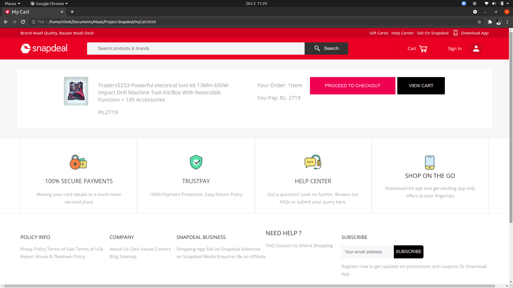
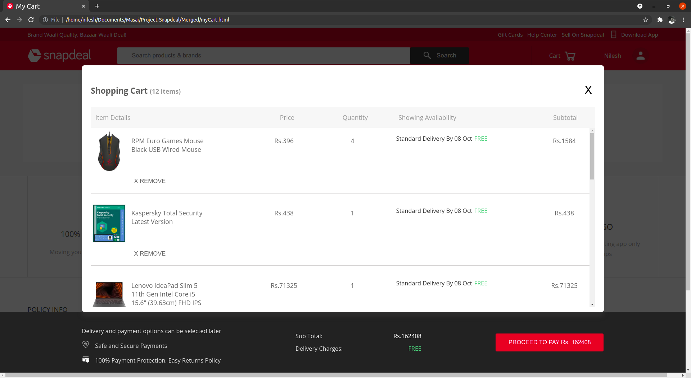

- Payment Page
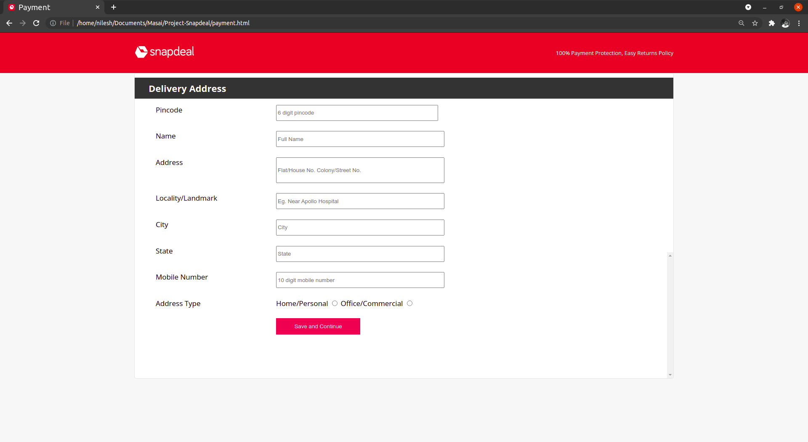
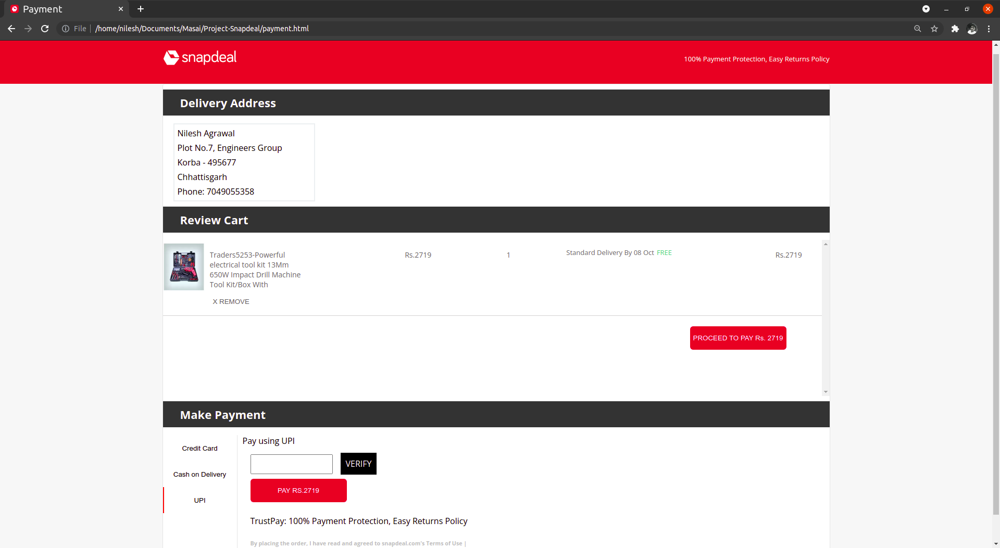

